# Welcome!!!  -  Rogue Book Exchange Team!
#### Author: Frank Kergil
#
> From here down, until specified otherwise, will be instructions on how to interact to the GitHub repo for our Rogue Book Exchange web project

## Let's talk basics
Currently you have read-only access to the repo. This is to make sure that there are no whoopsies in the main repository.  If you have a reason that you think you should have write permissions directly to the repo then please let me know. Otherwise there shouldn't be any problems with the work flow.

## How do I start working
As described in class there is definitely a pretty strict process for working on this project. Since I am by no means an expert at 'git flow' I will be learning with the rest of you in the same way. However, with the semi-strict guidelines we should have little to no problem moving forward.

### Step 1: Setting up your workspace and starting work
If for some reason you are not reading this on git hub already you can visit the link to go to the [GitHub RBE Repository](https://github.com/RogueCommunityCollegeWebDevelopers/roguebookexchange). 

#####Look for a button that looks like this:
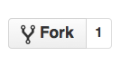

#####Choose your own repository to fork the project into. The screen will look something like this:
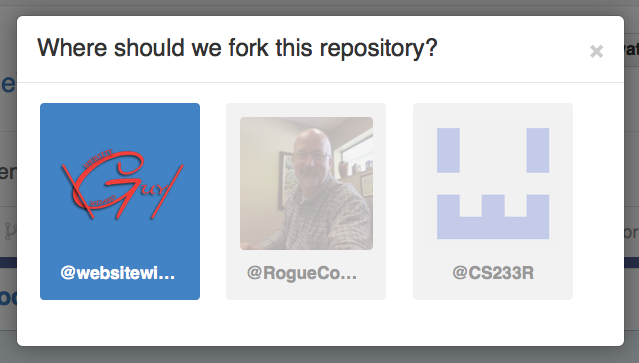

#####After that you will be taken to this screen:
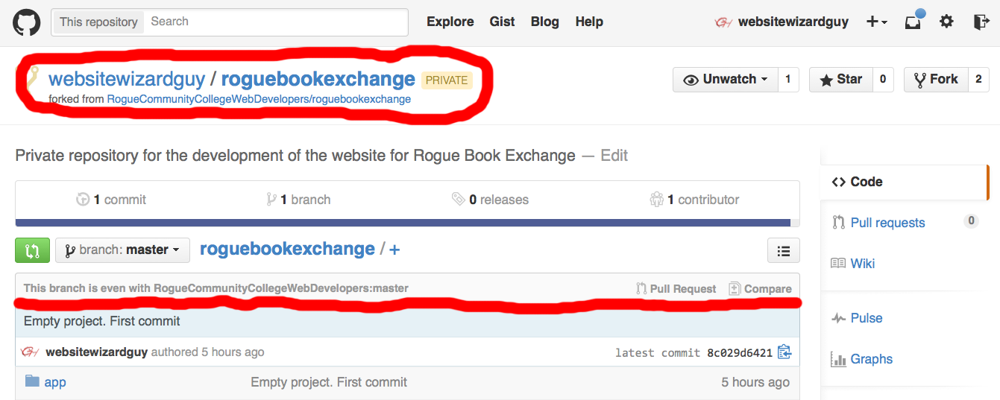
> Notice the two underlined portions of the picture. You now have a working copy of the project in your own repo and you can see where there is a red underline that your repository is even with the repo on the RogueCommunityCollegeWebDevelopers repo where the official project lives. If you have made changes to your fork, or there have been changes made to the official project, this is where you will be notified.

#####After you're taken to this screen you can clone the repository right here:
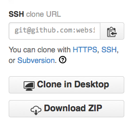
> Try the SSH version first because supposedly it is better but if it doesn't work for you (like it didn't work for me) then the HTTP version seemed to work fine, you just need to type in your GitHub credentials to make it go through

#####Start up a nitrous box
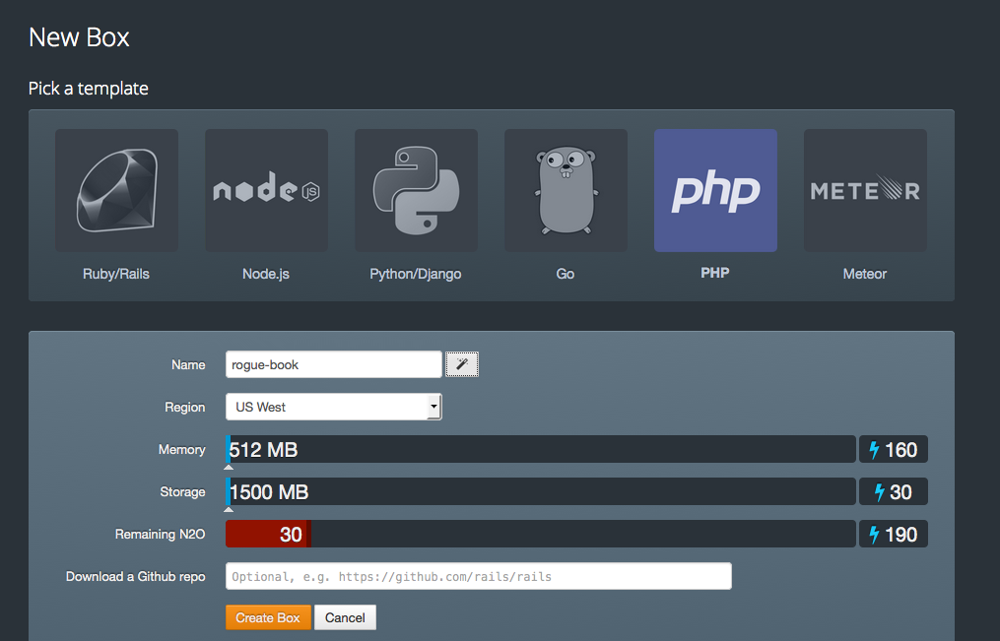
> **MAKE SURE YOU REMEMBER TO CHOOSE PHP (I forgot twice when testing this out)**

#####Once you have created a box. Change into your workspace directory:
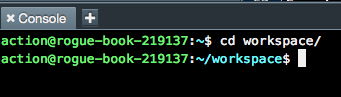

##### After that run ``git clone <your HTTP clone URL>``

#####Click on the Show Hidden button on the bottom right of your directory navigation pane:
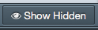

#####After that navigate to ``/.parts/etc/apache2/httpd.conf`` and change your root directory to point to the public folder within the Laravel project
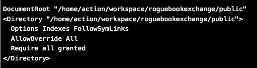

####If everything works you should be able to view the project on port 3000

---

###Step 2: Using git to work on your project.
Once you have your work station set up you can start working on your new feature. There is only a handful of git commands that you will need to know to stay in the clear.

##### ``git add .``
With this command you will add any and all *newly* created files to the staging area to be included in your next commit.
##### ``git commit -a -m 'your message here'``
With this command you will re-add any modified files to the staging area to make sure that they are in there most current state *AND* it will make a commit of your current work with the message of your choosing in one swoop.
##### ``git status``
With this command you will be able to see what your staging area looks like. An example might look like this 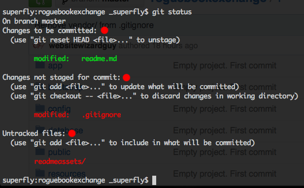
> Pay attention to the three sections marked with a red dot. 
> You have your files that are currently in the staging area to be committed 
> You have your files that have been modified since the last time you ran the command ``git add .`` or ``git commit -a -m 'your message here'`` 
> And you have files that are listed as untracked. These are any new project files that did not exist before your last commit.

##### ``git push origin master``
This command is best done right after you have made a commit to the project. When you clone a project git will automatically set up remote connection to your repository on GitHub. Running this command will push anything that you have changed to that online repo.
> Note: 'origin' is the default alias name to reference the remote connection. 'master' is the name of the local branch that you will probably 98% of the time be working from.

### A few important conventions for being a respectful git user.
#### 1. Use *descriptive* messages in the *present tense* on all of your commits
If you had a commit with a message that said "Removed header image from site" would you want to rollback to before or after that commit to have the image be there. You have to think about it for a second right... Now change that message to the present tense: "Remove header image from site". Now it is perfectly clear that to rollback to where the image is still there you need to rollback to before that commit.
> Some people might not have trouble figuring out past tense messages but in order to keep things looking nice and uniformed let's try our best to stick to present tenses

#### 2. Don't commit to frequently or infrequently
There seems to be a balance between making too many commits and making to few commits. Everyone will have a slightly different idea of where that balance is. For this one just use your best judgment to determine what is appropriate. As a general guide line you want to separate your commits in to individual, well defined tasks that you have done. That way you can rollback in a step by step fashion. Which leads me into the last point

#### 3. ALWAYS MAKE SURE THE CHANGES MADE WORK *BEFORE* YOU COMMIT IT
This should go without saying much so I will be brief. While it is not that hard to undo or amend a commit if you have a simple working knowledge of git you should alway check to make sure that what you changed works as expected instead of just assuming that it works. *It will save you time and hassle in the long run*

### Step 3. Creating a pull request
This last step should be a piece of cake. If you are back on GitHub and viewing your repository you will see something like this 
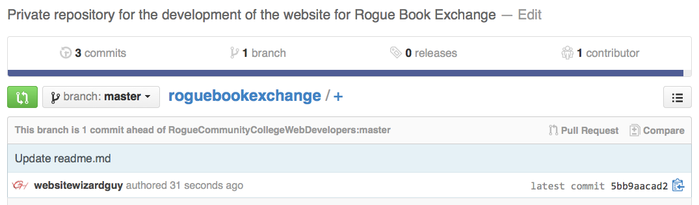

---

**After you will be taken to a page that looks like this** 

---

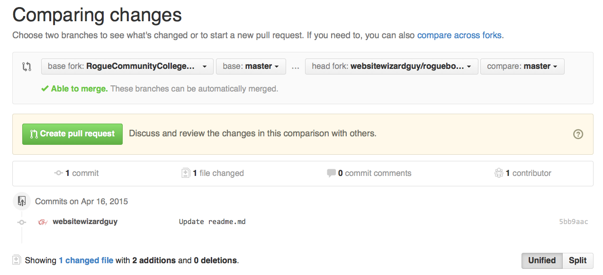

#### I'll let you take a random guess at what to click on from here (just keep all the messages default for right now until further notice)

---

### A few final notes
#### Connecting to mySQL
The database that your local project will connect to is location specific (i.e. Nitrous vs. home computer vs. RCC computer). There might be a way to run a terminal command and have it all automatically generated for you but I am unfamiliar as of yet how to do that. 
After you have manually created your database, rename the file `.env.example` to just plain old `.env` and then modify it to connect to your database using whatever credentials you set up.
##### Adding tables
You will not, however, need to manually create the tables for the database. All you will need to do once you are connected to your mySQL, you can just run ``php artisan migrate`` at the command line to import the entire database schema.

### Actually installing and starting from scratch:

#### On ubuntu 14.04

* make sure you have php installed
* make sure you have php mcrypt extension installed (apt-get install php-mcrypt, sudo php5enmod mcrypt, sudo service apache2 restart (maybe not necessary?))
* install composer (curl -sS https://getcomposer.org/installer | sudo php -- --install-dir=/usr/local/bin --filename=composer)
* use it to install your dependencies (cd into checked out repo, 'composer update')

* on nitrous, cd /var/www && sudo rm html && sudo ln -s /home/nitrous/roguebooks.com/public html

* chmod -R a+w ~/roguebooks.com/storage

* set up db 'mysql' then
  create database rogue_be;
* php artisan migrate
